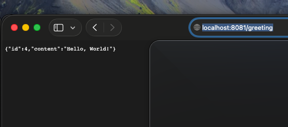
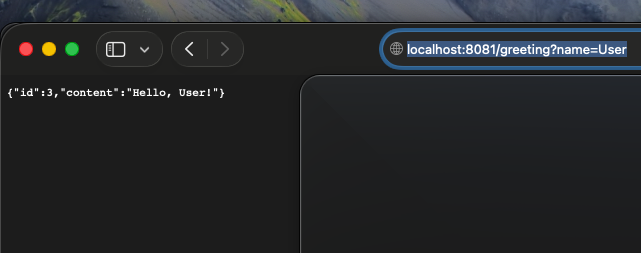
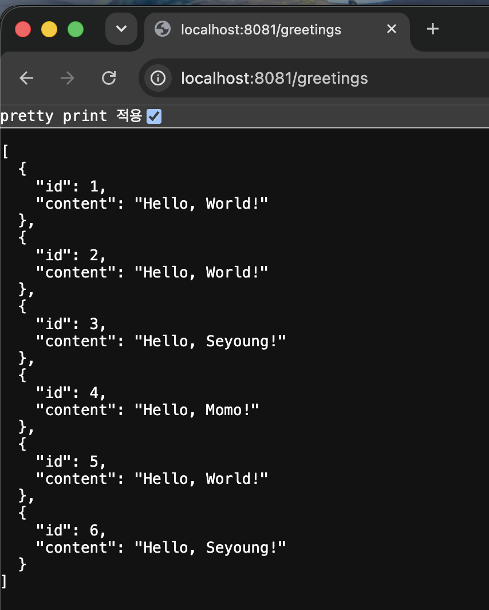

# 1단계: Building a RESTful Web Service

## 무엇을 만드는 Guide인가?
GET /greeting 요청을 받아 JSON 형태의 인사말을 응답하는 가장 단순한 REST API.
쿼리 파라미터 name을 넘기면 응답 내용이 그 값으로 바뀐다.

## 새롭게 배운 Spring 기술
- @SpringBootApplication
- @RestController
- @GetMapping
- @RequestParam
- Java Record (DTO)
- Jackson을 통한 JSON 자동 변환

## 핵심 Annotation 설명
| Annotation | 설명 |
|---|---|
| @SpringBootApplication | Configuration + EnableAutoConfiguration + ComponentScan을 합친 것. 서버 자동 설정 및 실행 담당 |
| @RestController | 이 클래스의 메서드가 View가 아니라 데이터를 직접 반환한다는 표시. @Controller + @ResponseBody |
| @GetMapping("/greeting") | GET /greeting 요청을 이 메서드에 연결 |
| @RequestParam | 쿼리스트링 값을 파라미터로 바인딩, 없으면 defaultValue 사용 |

## Step 1~2: 기본 구현 및 실행 화면

### GET /greeting

### GET /greeting?name=User

### 겪은 문제와 해결
- 처음에 8080 포트가 이미 사용 중이라 서버 실행이 실패했음
  → application.properties에 server.port=8081 지정해서 해결

## Step 3: 가이드 없이 재구현

가이드 페이지와 기존 코드를 보지 않고 Greeting, GreetingController를 처음부터 다시 작성해봄.
- @RestController와 @Controller의 차이를 정확히 몰랐는데, 2단계(Thymeleaf) 진행하면서 비교하고 나서 이해가 명확해짐
- localhost와 port 개념을 이번에 제대로 이해함
- record의 생성자/getter 자동 생성 원리를 다시 짚어보고 나서야 손으로 막힘없이 작성 가능해짐

## Step 4: 기능 확장 — 인사말 목록 조회 기능 추가

기존 /greeting 엔드포인트는 매번 하나의 인사말만 반환하고 끝났는데,
지금까지 요청받은 인사말을 서버 메모리에 저장해두고,
/greetings 엔드포인트로 전체 목록을 조회할 수 있게 확장했다.

### 추가한 것
- CopyOnWriteArrayList<Greeting>으로 요청 이력 저장 (동시 요청에도 안전하게)
- GET /greetings 엔드포인트 추가

### 실행 화면

### 느낀 점
- AtomicLong처럼 CopyOnWriteArrayList도 "동시성에 안전한" 자료구조라는 걸 배움
- private final이 왜 필요한지(캡슐화, 재할당 방지) 처음엔 놓쳤다가 다시 짚어봄