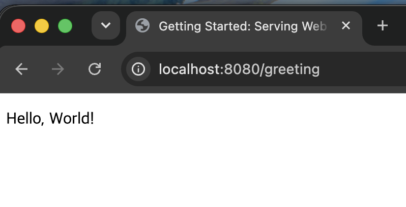
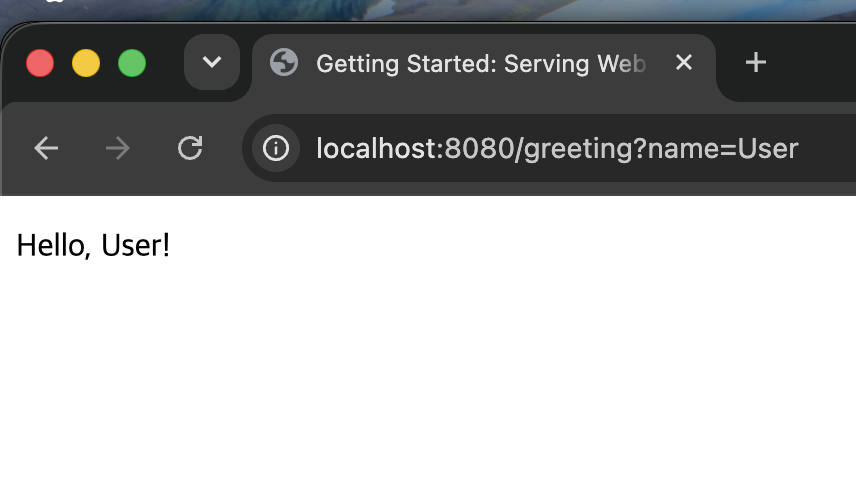
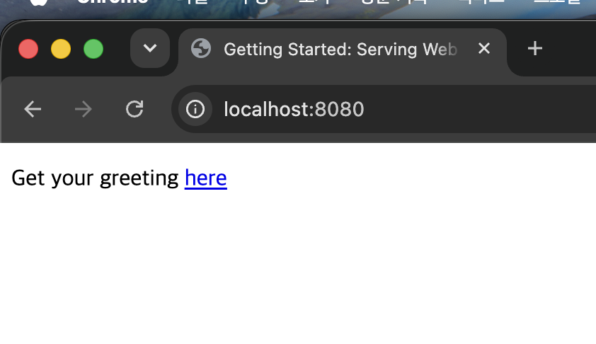

# 2단계: Serving Web Content with Spring MVC

## 무엇을 만드는 Guide인가?
GET /greeting 요청을 받아 JSON이 아니라 실제 HTML 화면을 렌더링해서 보여주는 서비스.
쿼리 파라미터 name을 넘기면 화면에 표시되는 인사말 내용이 바뀐다.
루트 경로(/)에는 정적 홈페이지(index.html)를 추가해 /greeting으로 이동하는 링크를 제공한다.

## 새롭게 배운 Spring 기술
- Spring MVC (Model-View-Controller 구조)
- @Controller
- Model
- Thymeleaf 템플릿 엔진
- templates / static 폴더의 역할 차이

## 핵심 Annotation / 개념 설명
| 개념 | 설명 |
|---|---|
| @Controller | 메서드 반환값이 데이터가 아니라 "보여줄 화면 이름"임을 나타냄. @RestController와 달리 @ResponseBody가 없음 |
| Model | 컨트롤러에서 View(HTML)로 데이터를 전달하는 통로. model.addAttribute("name", name) 형태로 사용 |
| Thymeleaf (th:text) | HTML 안에서 서버 데이터를 렌더링하는 템플릿 문법. th:text="\|Hello, ${name}!\|" |
| templates 폴더 | Thymeleaf가 처리하는 동적 HTML 위치. 컨트롤러의 return 값과 파일명이 일치해야 렌더링됨 |
| static 폴더 | 정적 파일 위치. index.html은 루트(/) 접속 시 자동으로 보여짐 |

## @RestController vs @Controller 비교 (1단계와의 차이)
| | @RestController (1단계) | @Controller (2단계) |
|---|---|---|
| 반환값의 의미 | 응답 데이터 그 자체 | 보여줄 화면(View) 이름 |
| 응답 형태 | JSON | HTML |
| 실제 동작 | Jackson이 객체를 JSON으로 자동 변환 | ViewResolver가 이름 + templates/ + .html 규칙으로 실제 파일을 찾아 렌더링 |

## Step 1: 기본 구현 및 실행 화면

### GET /greeting

### GET /greeting?name=User

### GET / (홈페이지)

### 겪은 문제와 해결
- templates 폴더 안에 templates 폴더가 중첩 생성되어(templates/templates/greeting.html)
  "Error resolving template [greeting]" 에러 발생
  → 폴더 구조를 templates/greeting.html로 바로잡아 해결
- Java 17 툴체인을 찾지 못해 Gradle 동기화 실패
  → build.gradle의 JavaLanguageVersion을 21로 맞춰서 해결

## 느낀 점
- 같은 String을 반환해도 @Controller와 @RestController에 따라 완전히 다르게 처리된다는 걸 직접 확인함
- ViewResolver가 "templates/" + 이름 + ".html" 규칙을 자동으로 처리해준다는 걸 이해함 (Spring Boot 자동 설정)
- static과 templates 폴더의 차이(컨트롤러 개입 여부)를 명확히 이해함