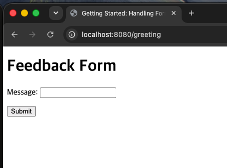
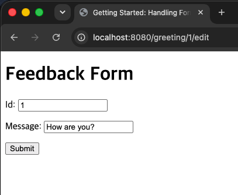
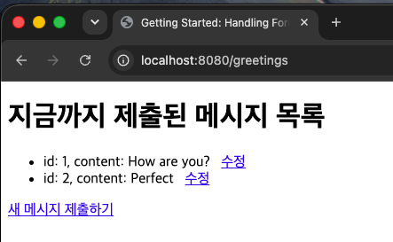

# 3단계: Handling Form Submission

## 무엇을 만드는 Guide인가?

브라우저 화면에 입력 폼(Id, Message)을 띄우고, 사용자가 값을 입력해 제출(Submit)하면
그 값을 서버가 받아서 결과 화면에 그대로 보여주는 서비스.
2단계가 URL 쿼리스트링(?name=)으로 값을 받았다면, 이번엔 HTML <form>을 통해 POST 방식으로 값을 받는다.

## 새롭게 배운 Spring 기술

- GET / POST 요청의 차이와 역할 분리
- @ModelAttribute를 이용한 폼 데이터 자동 바인딩
- Thymeleaf th:object, th:field, th:action
- 일반 class + getter/setter (record 대신 사용하는 이유)

## 핵심 Annotation / 개념 설명

| 개념                          | 설명                                                                                      |
|-----------------------------|-----------------------------------------------------------------------------------------|
| @GetMapping vs @PostMapping | 같은 경로(/greeting)라도 HTTP 메서드에 따라 다른 메서드가 처리하도록 분리 가능                                     |
| @ModelAttribute             | 폼에서 넘어온 여러 필드 값을 자동으로 하나의 객체(Greeting)에 채워서 파라미터로 받음                                    |
| th:object="${greeting}"     | 폼 전체가 다룰 객체를 지정                                                                         |
| th:field="*{id}"            | th:object로 지정한 객체의 필드와 input을 연결. ${greeting.id}의 축약형                                   |
| record 대신 class 사용          | 폼은 "빈 객체를 먼저 만들고 나중에 setter로 값을 채우는" 방식이 필요한데, record는 생성 후 값 변경이 불가능(불변)해서 이 방식에 맞지 않음 |

## Step 1: 기본 구현 및 실행 화면

### GET /greeting (폼 화면)

### POST /greeting 제출 후 결과 화면

### 겪은 문제와 해결

- 폴더 이름을 handling-form-submission → 03-handling-form-submission으로 리팩터링하는 과정에서
  IntelliJ가 이 폴더를 Gradle 모듈로 인식하지 못해 New 메뉴에 Java 파일 생성 옵션이 안 뜨는 문제 발생
  → 프로젝트를 닫았다가 다시 열어서(Close Project → Reopen) 모듈로 재인식시켜 해결
- Model이 내가 직접 만드는 게 아니라 Spring이 요청 처리마다 자동으로 만들어서 파라미터에 넣어주는 객체라는 걸 다시 확인함 (제어의 역전)
- 같은 URL(/greeting)이라도 HTTP 메서드(GET/POST)에 따라 완전히 다른 메서드가 처리된다는 걸 직접 확인
- 폼을 다룰 때는 record가 아니라 getter/setter가 있는 일반 클래스를 써야 하는 이유(값이 나중에 채워져야 하므로)를 이해함

## Step 3: 가이드 없이 재구현

가이드 페이지와 기존 코드를 보지 않고 Greeting, GreetingController, greeting.html, result.html을
처음부터 다시 작성해봄.

- record 대신 일반 class + getter/setter를 쓰는 이유를 다시 짚어봄 (폼은 빈 객체를 먼저 만들고
  나중에 setter로 값을 채우는 방식이 필요한데, record는 생성 후 값 변경이 불가능하기 때문)
- @ModelAttribute가 폼의 여러 필드 값을 자동으로 하나의 객체에 채워서 파라미터로 넘겨준다는 걸
  직접 손으로 짜보면서 다시 확인함

## Step 4: 기능 확장 — 메시지 수정 기능 및 목록 조회 추가

기존에는 메시지를 한 번 제출하면 그걸로 끝이었는데, 아래 기능을 추가해 CRUD의 Update, Read를
경험해볼 수 있도록 확장했다.

### 추가한 것

- id 자동 부여 (AtomicLong 사용)
- GET /greeting/{id}/edit — 기존 메시지 내용을 폼에 채워서 보여주는 수정 폼
- POST /greeting/{id} — 수정된 내용을 저장 (기존 id 유지)
- GET /greetings — 지금까지 제출된 메시지 전체 목록 조회, 각 항목에 수정 링크 포함
- @PathVariable을 이용해 URL 경로(/greeting/3/edit) 자체에 id를 담아 전달하는 방식 사용
- 신규 작성 폼에서는 th:if로 불필요한 id=0 노출을 숨기고, hidden input으로 값만 유지

### 실행 화면

### 겪은 문제와 해결

- @PathVariable과 @RequestParam의 차이를 명확히 구분함 (경로 자체에 값이 있는지, 쿼리스트링에 값이 있는지)
- Model에 담는 key 문자열은 컴파일러가 검증해주지 않기 때문에, 컨트롤러와 View 양쪽에서
  이름이 정확히 일치하는지 직접 확인하는 습관이 필요함을 배움
- th:if를 이용해 조건에 따라 화면 요소를 다르게 보여주는 방법을 새로 익힘