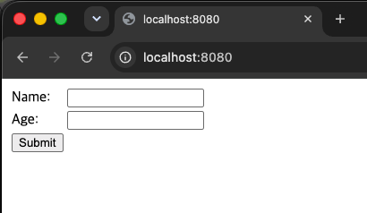
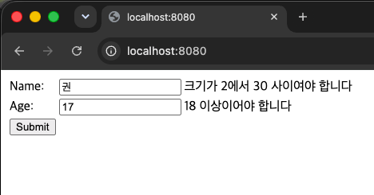
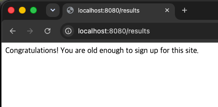

# 4단계: Validating Form Input

## 무엇을 만드는 Guide인가?

사용자가 이름(Name)과 나이(Age)를 입력하는 폼에서, 값이 유효하지 않으면(이름 길이 부족, 나이 미달 등)
에러 메시지를 화면에 보여주며 다시 입력받고, 값이 유효하면 결과 페이지로 리다이렉트하는 서비스.
3단계가 값을 그냥 받아서 저장했다면, 이번엔 Bean Validation으로 입력값을 검사하는 것이 핵심이다.

## 새롭게 배운 Spring 기술

- Bean Validation (@NotNull, @Size, @Min)
- @Valid + BindingResult 조합
- Post-Redirect-Get(PRG) 패턴
- WebMvcConfigurer, addViewControllers를 이용한 단순 View 매핑

## 핵심 Annotation / 개념 설명

| 개념                           | 설명                                                                                                 |
|------------------------------|----------------------------------------------------------------------------------------------------|
| @NotNull, @Size, @Min        | 필드에 붙여 값의 유효 조건을 선언. 실제 검사와 에러 메시지 생성은 Hibernate Validator가 담당                                     |
| @Valid                       | 컨트롤러 파라미터에 붙여 "이 객체를 애노테이션 조건대로 검사하라"고 지시                                                          |
| BindingResult                | 검사 결과(에러 유무, 에러 내용)를 담는 객체. 반드시 @Valid 파라미터 바로 다음에 위치해야 함                                          |
| th:errors, #fields.hasErrors | 특정 필드에 에러가 있는지 확인하고 메시지를 표시하는 Thymeleaf 문법                                                         |
| redirect:/경로                 | 서버가 View를 바로 렌더링하는 대신, 브라우저에게 그 경로로 새 GET 요청을 보내라고 지시. 주소창이 실제로 바뀌며, 폼 재제출(중복 제출) 문제를 방지함 (PRG 패턴) |
| addViewControllers           | 별도 처리 로직 없이 단순히 화면만 보여주면 되는 경로를 한곳에 모아 등록하는 방식. 경로가 여러 개일 때 @GetMapping을 반복하지 않아도 됨                |

## Step 1: 기본 구현 및 실행 화면

### GET / (폼 화면)

### 유효하지 않은 값 제출 시 에러 화면

### 유효한 값 제출 후 /results로 리다이렉트

### 겪은 문제와 해결

- 에러 메시지가 한국어로 자동 표시되는 것을 보고 이게 BindingResult가 만든 건 줄 알았으나,
  실제로는 Hibernate Validator가 각 애노테이션(@Size 등)의 기본 메시지 템플릿을 브라우저 언어 설정에 맞춰
  자동으로 채워준다는 것을 확인함. BindingResult는 그 결과를 담아두는 그릇 역할일 뿐임
- 3단계에서는 return "result"로 바로 View를 렌더링했는데, 이번엔 return "redirect:/results"를 쓴 이유를
  비교해보며 PRG 패턴(POST 후 새로고침 시 중복 제출을 막기 위한 관행)을 이해함

## 느낀 점

- @GetMapping으로 빈 메서드를 여러 개 만드는 것보다, addViewControllers에 단순 매핑들을 모아두는 것이
  "이 경로들은 로직이 없다"는 의도를 더 명확히 드러낼 수 있다는 설계 관점을 배움 (다만 경로가 하나뿐이라면
  @GetMapping 쪽이 더 간결할 수도 있음)
- age를 int가 아닌 Integer로 선언한 이유(원시 타입은 null이 될 수 없어 @NotNull 검증이 무의미해짐)를
  1단계에서 배운 long/Long 차이와 연결지어 이해함