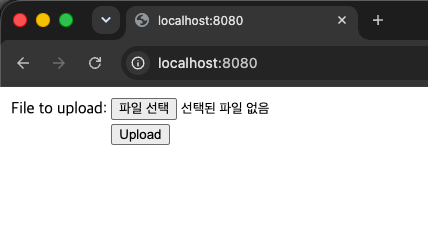
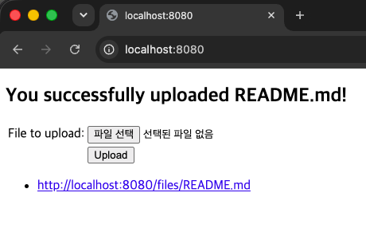
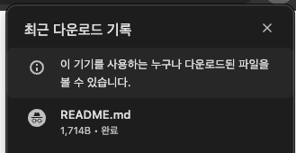

# 5단계: Uploading Files

## 무엇을 만드는 Guide인가?

파일을 업로드하면 서버(로컬 디스크)에 저장되고, 업로드된 파일 목록을 화면에서 확인하며
각 파일을 다시 다운로드할 수 있는 서비스. 지금까지는 텍스트 값만 다뤘다면,
이번엔 실제 파일(멀티파트 데이터)을 받아 저장하고 서빙하는 것이 핵심이다.

## 새롭게 배운 Spring 기술

- MultipartFile을 이용한 파일 업로드 처리
- @Service를 이용한 비즈니스 로직 계층 분리
- @Autowired 생성자 주입 (의존성 주입, DI)
- 인터페이스(StorageService) + 구현체(FileSystemStorageService) 설계
- @ConfigurationProperties를 이용한 외부 설정값 자동 바인딩
- CommandLineRunner를 이용한 앱 시작 시 초기화 작업
- @ExceptionHandler를 이용한 컨트롤러 단위 예외 처리
- RedirectAttributes(flash attribute)를 이용한 리다이렉트 후 1회성 메시지 전달

## 핵심 Annotation / 개념 설명

| 개념                                     | 설명                                                                                                        |
|----------------------------------------|-----------------------------------------------------------------------------------------------------------|
| MultipartFile                          | HTML 폼에서 enctype="multipart/form-data"로 전송된 파일을 표현하는 타입                                                   |
| @Service                               | 비즈니스 로직(실제 작업 처리)을 담당하는 클래스임을 표시. @Controller와 마찬가지로 Spring이 관리하는 Bean으로 등록됨                              |
| @Autowired (생성자 주입)                    | 필요한 객체를 직접 new로 만들지 않고, Spring이 이미 등록해둔 Bean을 자동으로 찾아 생성자에 넣어주는 것                                         |
| StorageService (인터페이스)                 | "저장소라면 이런 기능이 있어야 한다"는 규칙만 정의. 실제 저장 방식(로컬 디스크, 클라우드 등)은 구현체에서 결정하므로, 나중에 저장 방식이 바뀌어도 컨트롤러 코드는 그대로 둘 수 있음 |
| @ConfigurationProperties               | application.properties의 특정 접두사(storage.) 값을 자동으로 클래스 필드에 채워주는 애노테이션                                       |
| CommandLineRunner + @Bean              | 애플리케이션이 완전히 시작된 직후 한 번 실행되는 코드를 등록. 여기서는 업로드 폴더를 초기화하는 데 사용                                               |
| @ExceptionHandler                      | 특정 예외가 발생했을 때 이 컨트롤러 안에서 어떻게 처리할지 지정                                                                      |
| RedirectAttributes / addFlashAttribute | redirect: 이후에도 딱 한 번 값을 전달할 수 있게 해주는 기능. 일반 Model 값은 리다이렉트 시 사라지는 문제를 해결                                  |

## Step 1: 기본 구현 및 실행 화면

### 파일 업로드 폼 및 목록 화면

### 파일 업로드 성공 후 메시지 및 목록 갱신

### 업로드된 파일 다운로드

### 겪은 문제와 해결

- 파일 업로드 성공 시 redirect:/ 리다이렉트 과정에서 주소창에 ;jsessionid=... 가 붙으며
  Whitelabel 404 에러 페이지가 뜨는 문제 발생 (실제 파일 저장은 정상적으로 이루어짐)
  → 쿠키/시크릿 모드 여부와 무관하게 동일하게 발생하는 것을 확인해 코드 문제가 아님을 좁혀냄
  → application.properties에 server.servlet.session.tracking-modes=cookie 를 추가해
  세션 추적 방식을 쿠키로 고정시켜 URL에 세션ID가 붙는 현상을 막아 해결함